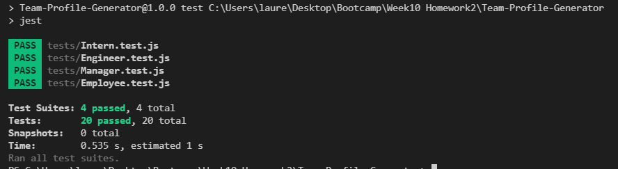
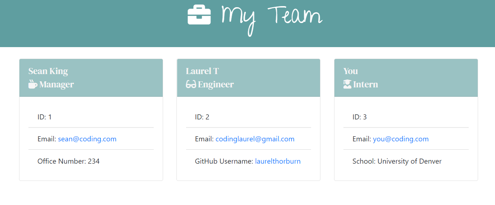

# Team Profile Generator

<a name="descsection"></a>
## Description
The purpose of this project was to create a command-line generated team profile generator using node.js.  The user is prompted with a series of questions that will be added to their final generated HTML page.  Questions are broken down into manager role and optional engineer and intern questions.  The user may add as many engineers and interns as they would like and may select the option of "Finish building my team" in order to generate their final product.

[](https://opensource.org/licenses/MIT)


## Table of Contents
1. [ Description. ](#descsection)
2. [ User Story. ](#usersection)
3. [ Acceptance Criteria. ](#acceptancesection)
4. [ Installation. ](#installsection)
5. [ Usage. ](#usagesection)
6. [ License. ](#licensesection)
7. [ Contributing. ](#contribsection)
8. [ Tests. ](#testsection)
9. [ Questions. ](#questionssection)
10. [ Video. ](#videosection)
11. [ Screenshots. ](#picsection)
12. [ Links. ](#linksection)
13. [ Resources/Credit. ](#creditsection)

<a name="usersection"></a>
## User Story
```
AS A manager
I WANT to generate a webpage that displays my team's basic info
SO THAT I have quick access to their emails and GitHub profiles
```

<a name="acceptancesection"></a>
## Acceptance Criteria
```
GIVEN a command-line application that accepts user input
WHEN I am prompted for my team members and their information
THEN an HTML file is generated that displays a nicely formatted team roster based on user input
WHEN I click on an email address in the HTML
THEN my default email program opens and populates the TO field of the email with the address
WHEN I click on the GitHub username
THEN that GitHub profile opens in a new tab
WHEN I start the application
THEN I am prompted to enter the team manager’s name, employee ID, email address, and office number
WHEN I enter the team manager’s name, employee ID, email address, and office number
THEN I am presented with a menu with the option to add an engineer or an intern or to finish building my team
WHEN I select the engineer option
THEN I am prompted to enter the engineer’s name, ID, email, and GitHub username, and I am taken back to the menu
WHEN I select the intern option
THEN I am prompted to enter the intern’s name, ID, email, and school, and I am taken back to the menu
WHEN I decide to finish building my team
THEN I exit the application, and the HTML is generated
```

<a name="installsection"></a>
## Installation
* Clone the repository using:
```
git clone https://github.com/laurelthorburn/Team-Profile-Generator.git
```
* Ensure you are in the current working directory
* Install dependencies (jest and inquirer) by opening the terminal (ctrl + j on windows) and running:
```
npm install
```
* Run the project by typing the following in the terminal:
```
node index.js
```


<a name="usagesection"></a>
## Usage
* In order to access the user questions, open the terminal (right click index.js and click 'open in integrated terminal')
* Answer all prompted questions until the terminal reads "Your team is now on display, navigate to the folder 'dist' and then click 'index.html'. Great job building your team!"
* In the sidebar of the current directory, open the dist folder and click the newly generated index.html
* To view the index.html, right click on the file and select "open with live server"

<a name="licensesection"></a>
## License
Copyright <2021>

Permission is hereby granted, free of charge, to any person obtaining a copy of this software and associated documentation files (the "Software"), to deal in the Software without restriction, including without limitation the rights to use, copy, modify, merge, publish, distribute, sublicense, and/or sell copies of the Software, and to permit persons to whom the Software is furnished to do so, subject to the following conditions:

The above copyright notice and this permission notice shall be included in all copies or substantial portions of the Software.

THE SOFTWARE IS PROVIDED "AS IS", WITHOUT WARRANTY OF ANY KIND, EXPRESS OR IMPLIED, INCLUDING BUT NOT LIMITED TO THE WARRANTIES OF MERCHANTABILITY, FITNESS FOR A PARTICULAR PURPOSE AND NONINFRINGEMENT. IN NO EVENT SHALL THE AUTHORS OR COPYRIGHT HOLDERS BE LIABLE FOR ANY CLAIM, DAMAGES OR OTHER LIABILITY, WHETHER IN AN ACTION OF CONTRACT, TORT OR OTHERWISE, ARISING FROM, OUT OF OR IN CONNECTION WITH THE SOFTWARE OR THE USE OR OTHER DEALINGS IN THE SOFTWARE.

  <a name="contribsection"></a>
## Contributing
  
1. [Fork the repo!](https://docs.github.com/en/get-started/quickstart/fork-a-repo)
2. Create a feature branch:
```
git checkout -b yourname-branch
```
3. Commit changes:
```
git commit -m 'Your changes here'
```
4. Push to the branch:
```
git push origin yourname-branch
```
5. Submit a pull request and wait for it to be approved or denied.

  <a name="testsection"></a>
## Tests
  1. Ensure you have installed jest (this was installed earlier when 'npm install' was run in the command line)
  2. In the command line, write:
```
npm run test
```
  3. Confirm all four test files pass (see screenshot below). Test files are located in the tests folder and are titled: Employee.test.js, Engineer.test.js, Intern.test.js, and Manager.test.js

  <a name="questionssection"></a>
## Questions?
  Want to see more of my work? [Click here!](https://github.com/laurelthorburn)

  Questions/comments/concerns? Please send an email to codinglaurel@gmail.com
  
  <a name="videosection"></a>
## Video
  View video:https://drive.google.com/file/d/1WWoh5HfNbHgMmtJ4DR57lQ-1x9PrR4KR/view?usp=sharing

  <a name="picsection"></a>
  ## Screenshots
  
  

  <a name="linksection"></a>
  ## Links

  Deployed SAMPLE Site: https://laurelthorburn.github.io/Team-Profile-Generator/
  Github Site: https://github.com/laurelthorburn/Team-Profile-Generator

  <a name="creditsection"></a>
## Resources/Credit
* https://www.digitalocean.com/community/tutorials/nodejs-interactive-command-line-prompts
* Fellow coder champion: [Ryan Paragas!](https://github.com/ParagasR)
